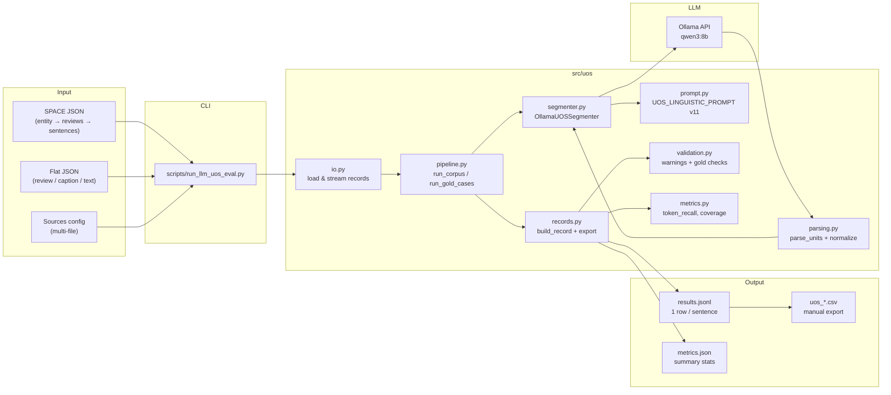
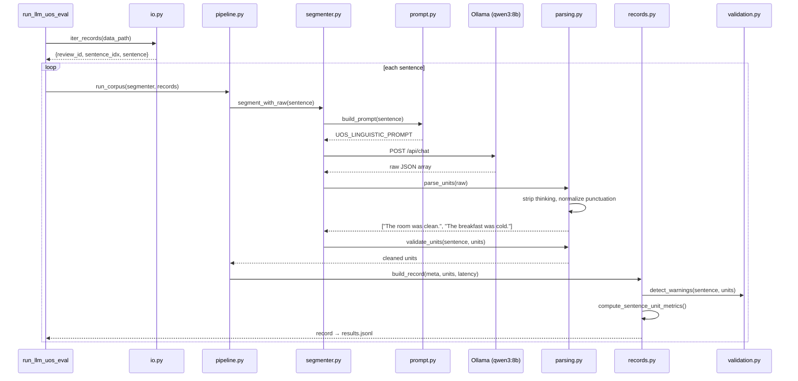
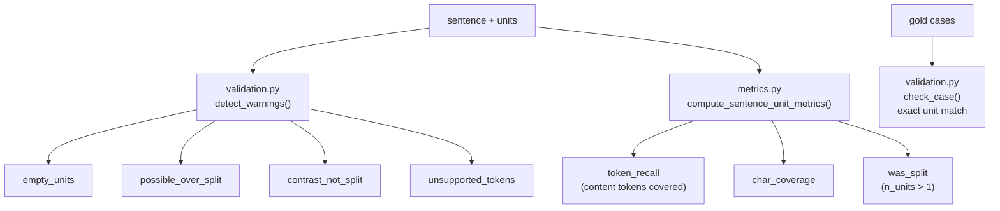

# UOS Splitting — Architecture

**Unit Opinion Sentence (UOS)** = một câu hoàn chỉnh, chỉ chứa **một ý kiến** về **một đối tượng**.

Pipeline tách câu review khách sạn thành các UOS bằng **Qwen 8B** qua **Ollama**.

## High-level flow



## Per-sentence processing



## Module responsibilities

```
src/uos/
├── prompt.py        # Linguistic rules + few-shot examples (linguistic_v11)
├── segmenter.py     # Ollama client, model alias, build_prompt, segment()
├── parsing.py       # Parse LLM JSON → list[str], normalize_unit()
├── pipeline.py      # run_corpus(), run_gold_cases(), progress callbacks
├── io.py            # Load SPACE / flat JSON, streaming via ijson
├── records.py       # build_record(), export_row(), summarize()
├── validation.py    # Rule-based warnings, gold-case exact match
├── metrics.py       # token_recall, char_coverage, was_split
└── __init__.py
```

| Module | Input | Output | Role |
|--------|-------|--------|------|
| `io.py` | JSON file (SPACE / flat / sources config) | `dict` per sentence | Stream records, auto-detect format & text column |
| `prompt.py` | `sentence: str` | prompt string | Encode splitting rules (SPLIT / DO NOT SPLIT) |
| `segmenter.py` | `sentence: str` | `(units, raw)` | Call Ollama, orchestrate prompt → parse |
| `parsing.py` | raw LLM text | `list[str]` | Extract JSON array, strip fences/thinking, add `.` |
| `pipeline.py` | segmenter + records | `list[dict]` | Batch loop, error fallback, gold-case smoke test |
| `records.py` | meta + units + latency | record dict | Attach metrics, warnings, export format |
| `validation.py` | sentence + units | warnings / ok | Detect over-split, contrast not split, gold match |
| `metrics.py` | sentence + units | recall, coverage | Measure information preservation |

## Data schema

### Input record (from `io.py`)

```json
{
  "entity_id": "46473.json",
  "review_id": "46473.json",
  "sentence_idx": 0,
  "sentence": "The room was clean but breakfast was cold.",
  "text_column": "review"
}
```

### Output record (`results.jsonl`)

```json
{
  "entity_id": "46473.json",
  "review_id": "46473.json",
  "sentence_idx": 0,
  "sentence": "The room was clean but breakfast was cold.",
  "units": ["The room was clean.", "The breakfast was cold."],
  "warnings": [],
  "metrics": {
    "n_units": 2,
    "was_split": true,
    "token_recall": 1.0,
    "char_coverage": 0.95,
    "latency_s": 3.2
  }
}
```

### CSV export (for ABSA input)

| entity_id | review_id | sentence_idx | sentence | units |
|-----------|-----------|--------------|----------|-------|
| 46473.json | 46473.json | 0 | The room was clean but... | `['The room was clean.', 'The breakfast was cold.']` |

## Prompt design (`linguistic_v11`)

Prompt dựa trên **quy tắc ngôn ngữ**, không phân loại aspect/sentiment:

```
Input sentence
    │
    ▼
┌─────────────────────────────────────┐
│  SPLIT rules                        │
│  • different targets + own opinion  │
│  • "and"/comma joins diff targets   │
│  • distribute shared adj to targets │
│  • contrasting opinions on 1 target │
│  • "with" + separate physical space │
└─────────────────────────────────────┘
    │
    ▼
┌─────────────────────────────────────┐
│  DO NOT SPLIT rules                 │
│  • multiple adj on ONE target       │
│  • holistic experience opinion      │
│  • logistics/context + 1 opinion    │
│  • factual statements (no opinion)  │
│  • accessories/features of target   │
└─────────────────────────────────────┘
    │
    ▼
JSON array of strings  (no markdown, no explanation)
```

**Ví dụ:**

| Input | Output units |
|-------|-------------|
| `The room was clean but breakfast was cold.` | `["The room was clean.", "The breakfast was cold."]` |
| `The room was spacious, comfortable and clean.` | `["The room was spacious, comfortable and clean."]` |
| `Very comfortable room and bed` | `["Very comfortable room.", "Very comfortable bed."]` |
| `There are two elevators.` | `["There are two elevators."]` |

## Quality checks



## CLI usage

```bash
# Single file
python scripts/run_llm_uos_eval.py \
  --data_path data/raw/hamos/fcaption_val.json \
  --text_column review \
  --input_format flat \
  --output_dir data/fcaption_review_val_v2 \
  --resume

# Smoke test gold cases only
python scripts/run_llm_uos_eval.py --run_cases

# Multi-source config
python scripts/run_llm_uos_eval.py \
  --data_path data/fixtures/uos_sources.json \
  --max_reviews 3
```

## Downstream: ABSA

UOS output là input cho bước ABSA:

```
results.jsonl  →  export CSV (uos_val.csv)  →  absa.annotate  →  quadruples
```

Xem `src/absa/README.md`.


python run_llm_uos_eval.py --data_path dataset/train.apc --output_dir output/test/

python run_llm_uos_eval.py --data_path dataset/train.apc --max_rows 10 --output_dir output/test/